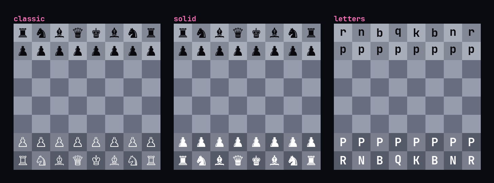

# ♛ Gambit — a chess coach

Play Stockfish at any strength with **live, move-by-move coaching**, analyse with
a real eval bar, drill engine-verified tactics, learn openings, and review your
games to see exactly where they turned.

Gambit comes in two flavours:

| | |
|---|---|
| 🖥️ **[Gambit Desktop](https://github.com/jprouhana/gambit-desktop)** | Cross-platform app (Windows · macOS · Linux). Real graphical board, drag-and-drop, self-contained — nothing to install. **Recommended.** |
| ⌨️ **Gambit (this repo)** | The original terminal app — pure-ANSI, graphic pieces via the kitty graphics protocol, runs in its own detached window. |

---

## 🖥️ Desktop app (recommended)

A self-contained desktop app — the chess engine is **Stockfish compiled to
WebAssembly** and rules come from **chess.js**, so there's no Python and no
separate engine binary to install. Same coaching as the terminal app, with a
real graphical board.

**Get it**

```bash
git clone https://github.com/jprouhana/gambit-desktop
cd gambit-desktop
npm install      # also vendors Stockfish WASM + chess.js
npm start        # run the app
```

Build native installers (Windows `.exe`, macOS `.dmg`, Linux `AppImage`):

```bash
npm run dist:win     # Windows: NSIS installer + portable
npm run dist:mac     # macOS: .dmg (x64 + arm64)
npm run dist:linux   # Linux: AppImage
```

Pre-built installers are produced by CI on each OS's own runner — see the
[Releases](https://github.com/jprouhana/gambit-desktop/releases) of the desktop
repo. Full docs: **https://github.com/jprouhana/gambit-desktop**.

---

## ⌨️ Terminal app (this repo)

A terminal chess coach in a clean, self-painted house style. Four switchable
piece styles (the default **sprites** mode renders graphic pieces via the kitty
graphics protocol):



```
┌─ gambit ──────────────────────────────────────────────┐
│  8 ♜ ♞ ♝ ♛ ♚ ♝ ♞ ♜       eval  +0.3                     │
│  7 ♟ ♟ ♟ ♟ · ♟ ♟ ♟             ███████░░░░░░            │
│  6 · · · · · · · ·                                      │
│  5 · · · · ♟ · · ·        ● you played  e5              │
│  4 · · · · ♙ · · ·          ✓ best (book) e5            │
│  3 · · · · · ♘ · ·                                      │
│  2 ♙ ♙ ♙ ♙ · ♙ ♙ ♙        coach: solid — contests       │
│  1 ♖ ♘ ♗ ♕ ♔ ♗ · ♖               the center             │
│    a b c d e f g h                                      │
│  [h]int  [f]lip  [u]ndo  [t]heme  [g]pieces  [q]uit     │
└─────────────────────────────────────────────────────────┘
```

### Modes
- **Play vs Engine** — full games at 8 strengths. After every move the coach
  rates it (best / inaccuracy / mistake / blunder) and shows the move you missed.
- **Game Review** — replay your last game move-by-move; every move you made is
  graded and the stronger line you should have played is shown, with a tally of
  your blunders/mistakes/inaccuracies. (Also reachable with `r` at game end.)
- **Analysis Board** — move freely, watch the live eval bar + engine best line.
- **Puzzles** — tactics positions, each verified live by the engine; your move is graded.
- **Opening Trainer** — drill 8 named openings, 16-ply mainlines, with the idea.

### Controls
```
mouse         click a piece then a square, OR drag-and-drop
↑↓←→ / hjkl   move cursor        ↵   pick piece, then destination
h  hint / best move              f   flip board
u  undo        g  piece style    t  cycle theme        q / esc  back
```
Legal squares for the picked piece glow; empty targets show a dot. `gambit` opens
in its **own ghostty window** (no shaders, `minimum-contrast` off, symbol font)
and detaches, so you can close the launching terminal and it keeps running. Press
**`g`** to cycle piece sets: **sprites** (default), **solid**, **classic**,
**letters**. The board auto-sizes; narrow panes stack the panel below.

### Install
```
./install.sh          # venv + python-chess + launcher in ~/.local/bin
gambit                # run
```
Needs `stockfish` on PATH for engine features: `yay -S stockfish`.

### Stack
Pure-stdlib ANSI rendering (24-bit colour, box-drawing, half-block board). Chess
rules + UCI engine via `python-chess`. Single file: `gambit.py`.

## License
MIT — see [LICENSE](LICENSE).
